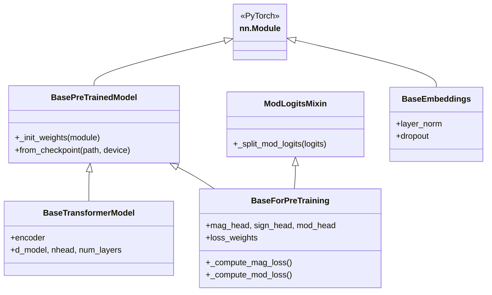

# `src/intseq_bert/base_models.py` Implementation Specification

## 1. Overview

**Target file:** `src/intseq_bert/base_models.py`

This module provides shared infrastructure for IntSeqBERT, the Vanilla Transformer, and the Ablation model. The shared components keep comparison experiments fair by reusing the same backbone utilities, initialization, prediction heads, and loss logic where appropriate.

| Component | Role |
|-----------|------|
| `ModLogitsMixin` | Splits concatenated Modulo logits by modulus |
| `generate_sinusoidal_encoding` | Builds sinusoidal positional encodings |
| `PositionalEncoding` | Positional-encoding module |
| `BasePreTrainedModel` | Shared checkpoint loading and weight initialization |
| `BaseEmbeddings` | Base class for embedding layers |
| `BaseTransformerModel` | Base Transformer Encoder backbone |
| `BaseForPreTraining` | Base pre-training wrapper with heads and loss utilities |

---

## 2. Dependencies

Libraries:

- `math`
- `typing`
- `torch`
- `torch.nn`

Config constants:

| Constant | Purpose |
|----------|---------|
| `D_MODEL` | Hidden dimension |
| `NHEAD` | Number of attention heads |
| `NUM_LAYERS` | Number of encoder layers |
| `DROPOUT` | Dropout rate |
| `FEEDFORWARD_MULTIPLIER` | FFN expansion factor, usually 4 |
| `POSITIONAL_ENCODING_BASE` | Positional-encoding base, usually 10000 |
| `NUM_SIGN_CLASSES` | Number of sign classes, 3 |
| `MOD_RANGE` | Moduli from 2 to 101 |
| `LOSS_WEIGHT_MAG/SIGN/MOD` | Fixed multi-task loss weights |
| `MAG_LOSS_TYPE` | Magnitude loss type |
| `USE_HETEROSCEDASTIC_LOSS` | Uncertainty-estimation flag |
| `LOG_VAR_CLIP_MIN/MAX` | Log-variance clipping range |

---

## 3. Mixin

### 3.1 `ModLogitsMixin`

Provides a helper for splitting a single concatenated Modulo-logit tensor into per-modulus tensors.

```python
class ModLogitsMixin:
    def _split_mod_logits(self, logits: Tensor) -> List[Tensor]:
        """
        Args:
            logits: (*, sum(MOD_RANGE)) = (*, 5150)

        Returns:
            List of tensors with shapes (*, 2), (*, 3), ..., (*, 101)
        """
        return torch.split(logits, config.MOD_RANGE, dim=-1)
```

---

## 4. Shared Components

### 4.1 `generate_sinusoidal_encoding(max_len, d_model)`

Generates a sinusoidal positional-encoding table.

Inputs:

- `max_len`: maximum sequence length.
- `d_model`: model dimension.

Output:

- Tensor of shape `(1, max_len, d_model)`.

Core formula:

```python
pe[:, 0::2] = sin(position * div_term)
pe[:, 1::2] = cos(position * div_term)
```

### 4.2 `PositionalEncoding`

Module wrapper around fixed sinusoidal positional encodings.

| Argument | Type | Default |
|----------|------|---------|
| `d_model` | int | - |
| `dropout` | float | 0.1 |
| `max_len` | int | 5000 |

Forward:

- Input: `(B, L, D)`
- Output: `(B, L, D)` after positional encoding and dropout.

---

## 5. Base Classes

### 5.1 `BasePreTrainedModel`

Provides checkpoint loading and weight initialization.

| Method | Description |
|--------|-------------|
| `_init_weights(module)` | Initializes Linear, Embedding, and LayerNorm modules |
| `from_checkpoint(path, device)` | Restores a model from a checkpoint |

Initialization rules:

| Module | Initialization |
|--------|----------------|
| `nn.Linear` | weight: N(0, 0.02), bias: 0 |
| `nn.Embedding` | weight: N(0, 0.02), padding row: 0 |
| `nn.LayerNorm` | weight: 1, bias: 0 |

Checkpoint loading:

```python
@classmethod
def from_checkpoint(cls, path, device="cpu", **kwargs):
    checkpoint = torch.load(path, map_location=device)
    ckpt_config = checkpoint.get("config", {})
    model = cls(**{**ckpt_config, **kwargs})
    model.load_state_dict(checkpoint["model_state_dict"])
    return model.to(device).eval()
```

### 5.2 `BaseEmbeddings`

Defines shared embedding-layer components.

| Argument | Type |
|----------|------|
| `d_model` | int |
| `dropout` | float |
| `max_len` | int |

Shared components:

- `layer_norm`: `nn.LayerNorm(d_model)`
- `dropout`: `nn.Dropout(dropout)`

### 5.3 `BaseTransformerModel`

Defines the common Transformer Encoder backbone.

| Argument | Type | Default |
|----------|------|---------|
| `d_model` | int | `config.D_MODEL` |
| `nhead` | int | `config.NHEAD` |
| `num_layers` | int | `config.NUM_LAYERS` |
| `dropout` | float | `config.DROPOUT` |

Architecture:

```python
encoder_layer = nn.TransformerEncoderLayer(
    d_model=d_model,
    nhead=nhead,
    dim_feedforward=d_model * FEEDFORWARD_MULTIPLIER,
    dropout=dropout,
    batch_first=True,
    norm_first=True,  # Pre-LN
)
encoder = nn.TransformerEncoder(encoder_layer, num_layers)
```

### 5.4 `BaseForPreTraining`

Provides shared prediction heads and loss utilities for pre-training models.

Prediction heads:

| Head | Structure | Output dimension |
|------|-----------|------------------|
| `mag_head` | Linear -> ReLU -> Linear | 2 (`mu`, `log_var`) |
| `sign_head` | Linear | 3 |
| `mod_head` | Linear | `sum(MOD_RANGE)` ~= 5150 |

Fixed loss weights:

```python
loss_weights = register_buffer([LOSS_WEIGHT_MAG, LOSS_WEIGHT_SIGN, LOSS_WEIGHT_MOD])
# default: [1.0, 1.0, 2.0]
```

Loss helper methods:

| Method | Description |
|--------|-------------|
| `_compute_mag_loss(pred_mu, pred_log_var, target)` | Magnitude loss, forced to FP32 |
| `_compute_mod_loss(pred_logits, target_mods)` | Normalized Modulo loss |

Magnitude loss:

```python
if MAG_LOSS_TYPE == "huber":
    recon_loss = smooth_l1_loss(pred_mu, target)
elif MAG_LOSS_TYPE == "mse":
    recon_loss = mse_loss(pred_mu, target)
elif MAG_LOSS_TYPE == "l1":
    recon_loss = l1_loss(pred_mu, target)

if USE_HETEROSCEDASTIC_LOSS:
    log_var = clamp(log_var, LOG_VAR_CLIP_MIN, LOG_VAR_CLIP_MAX)
    loss = 0.5 * log_var + recon_loss * exp(-log_var)
else:
    loss = recon_loss.mean()
```

Modulo loss:

```python
for i, logits in enumerate(split_mod_logits(pred_logits)):
    loss_m = cross_entropy(logits, target_mods[:, i])
    total_loss += loss_m / log(MOD_RANGE[i])
return total_loss / num_moduli
```

---

## 6. Inheritance Sketch



---

## 7. Usage Example

```python
from intseq_bert.base_models import (
    BaseForPreTraining,
    ModLogitsMixin,
    generate_sinusoidal_encoding,
)

pe = generate_sinusoidal_encoding(max_len=512, d_model=256)

class MyModel(BaseForPreTraining):
    def __init__(self, d_model=256):
        super().__init__(d_model)
        self.backbone = ...
```
