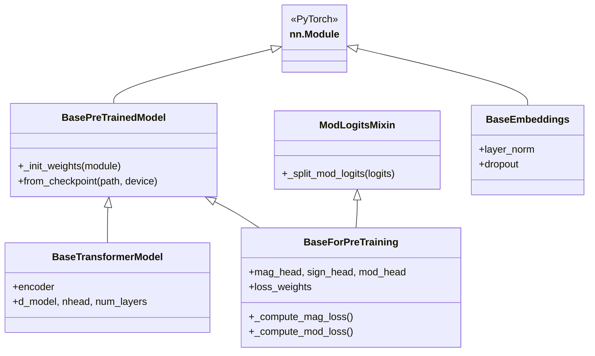

# `src/intseq_bert/base_models.py` 実装仕様書

## 1. 概要

**対象ファイル:** `src/intseq_bert/base_models.py`

**目的:**
IntSeqBERT、Vanilla Transformer、および Ablation Model の共通インフラを提供する。
公平な比較実験のため、以下のコンポーネントを共有する。

| コンポーネント | 役割 |
|---------------|------|
| `ModLogitsMixin` | Modulo logits 分割機能 |
| `generate_sinusoidal_encoding` | Positional Encoding 生成 |
| `PositionalEncoding` | PE モジュールクラス |
| `BasePreTrainedModel` | チェックポイント読み込み基底クラス |
| `BaseEmbeddings` | 埋め込み層基底クラス |
| `BaseTransformerModel` | Transformer Encoder 基底クラス |
| `BaseForPreTraining` | 事前学習モデル基底クラス |

---

## 2. 依存関係

### ライブラリ
- `torch`, `torch.nn`, `math`, `typing`

### 設定 (`config.py`)

| 定数 | 用途 |
|------|------|
| `D_MODEL` | 隠れ層次元 |
| `NHEAD` | Attention ヘッド数 |
| `NUM_LAYERS` | Encoder 層数 |
| `DROPOUT` | ドロップアウト率 |
| `FEEDFORWARD_MULTIPLIER` | FFN 拡大率 (4) |
| `POSITIONAL_ENCODING_BASE` | PE 基底 (10000) |
| `NUM_SIGN_CLASSES` | 符号クラス数 (3) |
| `MOD_RANGE` | 法のリスト (2〜101) |
| `LOSS_WEIGHT_MAG/SIGN/MOD` | 固定損失重み |
| `MAG_LOSS_TYPE` | Magnitude 損失種類 |
| `USE_HETEROSCEDASTIC_LOSS` | 不確実性推定フラグ |
| `LOG_VAR_CLIP_MIN/MAX` | log variance クリップ範囲 |

---

## 3. Mixin クラス

### 3.1. `ModLogitsMixin`

Modulo logits を法ごとに分割するヘルパー機能を提供。

```python
class ModLogitsMixin:
    def _split_mod_logits(self, logits: Tensor) -> List[Tensor]:
        """
        Args:
            logits: (*, sum(MOD_RANGE)) = (*, 5150)
        
        Returns:
            List of (*, 2), (*, 3), ..., (*, 101)
        """
        return torch.split(logits, config.MOD_RANGE, dim=-1)
```

---

## 4. 共有コンポーネント

### 4.1. `generate_sinusoidal_encoding(max_len, d_model)`

Sinusoidal Positional Encoding テーブルを生成。

**入力:**
- `max_len`: 最大系列長
- `d_model`: モデル次元

**出力:**
- `(1, max_len, d_model)` Tensor

**実装:**
```python
pe[:, 0::2] = sin(position * div_term)
pe[:, 1::2] = cos(position * div_term)
```

### 4.2. `PositionalEncoding`

Positional Encoding を管理するモジュール。

| 引数 | 型 | デフォルト |
|------|------|------|
| `d_model` | int | - |
| `dropout` | float | 0.1 |
| `max_len` | int | 5000 |

**Forward:**
- 入力: `(B, L, D)`
- 出力: `(B, L, D)` (PE 加算 + Dropout)

---

## 5. 基底クラス

### 5.1. `BasePreTrainedModel`

チェックポイント読み込みと重み初期化を提供。

#### メソッド

| メソッド | 説明 |
|----------|------|
| `_init_weights(module)` | Linear/Embedding/LayerNorm の初期化 |
| `from_checkpoint(path, device)` | チェックポイントからモデル復元 |

#### `_init_weights` 初期化ルール

| モジュール | 初期化 |
|-----------|--------|
| `nn.Linear` | weight: N(0, 0.02), bias: 0 |
| `nn.Embedding` | weight: N(0, 0.02), padding: 0 |
| `nn.LayerNorm` | weight: 1, bias: 0 |

#### `from_checkpoint` 処理

```python
@classmethod
def from_checkpoint(cls, path, device="cpu", **kwargs):
    checkpoint = torch.load(path, map_location=device)
    ckpt_config = checkpoint.get("config", {})
    model = cls(**{**ckpt_config, **kwargs})
    model.load_state_dict(checkpoint["model_state_dict"])
    return model.to(device).eval()
```

### 5.2. `BaseEmbeddings`

埋め込み層の共通構造を定義。

| 引数 | 型 |
|------|------|
| `d_model` | int |
| `dropout` | float |
| `max_len` | int |

**共通コンポーネント:**
- `layer_norm`: `nn.LayerNorm(d_model)`
- `dropout`: `nn.Dropout(dropout)`

### 5.3. `BaseTransformerModel`

Transformer Encoder バックボーンの共通構造。

| 引数 | 型 | デフォルト |
|------|------|------|
| `d_model` | int | `config.D_MODEL` |
| `nhead` | int | `config.NHEAD` |
| `num_layers` | int | `config.NUM_LAYERS` |
| `dropout` | float | `config.DROPOUT` |

**構成:**
```python
encoder_layer = nn.TransformerEncoderLayer(
    d_model=d_model,
    nhead=nhead,
    dim_feedforward=d_model * FEEDFORWARD_MULTIPLIER,
    dropout=dropout,
    batch_first=True,
    norm_first=True  # Pre-LN
)
encoder = nn.TransformerEncoder(encoder_layer, num_layers)
```

### 5.4. `BaseForPreTraining`

事前学習モデルの共通ヘッドと損失計算を提供。

#### 予測ヘッド

| ヘッド | 構造 | 出力次元 |
|--------|------|----------|
| `mag_head` | Linear→ReLU→Linear | 2 (mu, log_var) |
| `sign_head` | Linear | 3 |
| `mod_head` | Linear | sum(MOD_RANGE) ≈ 5150 |

#### 固定損失重み

```python
loss_weights = register_buffer([LOSS_WEIGHT_MAG, LOSS_WEIGHT_SIGN, LOSS_WEIGHT_MOD])
# デフォルト: [1.0, 1.0, 2.0]
```

#### 損失計算メソッド

| メソッド | 説明 |
|----------|------|
| `_compute_mag_loss(pred_mu, pred_log_var, target)` | Magnitude 損失 (FP32強制) |
| `_compute_mod_loss(pred_logits, target_mods)` | 正規化 Modulo 損失 |

**`_compute_mag_loss` 処理:**
```python
# config.MAG_LOSS_TYPE に応じて分岐
if MAG_LOSS_TYPE == 'huber':
    recon_loss = smooth_l1_loss(pred_mu, target)
elif MAG_LOSS_TYPE == 'mse':
    recon_loss = mse_loss(pred_mu, target)
elif MAG_LOSS_TYPE == 'l1':
    recon_loss = l1_loss(pred_mu, target)

# 不確実性推定
if USE_HETEROSCEDASTIC_LOSS:
    log_var = clamp(log_var, LOG_VAR_CLIP_MIN, LOG_VAR_CLIP_MAX)
    loss = 0.5 * log_var + recon_loss * exp(-log_var)
else:
    loss = recon_loss.mean()
```

**`_compute_mod_loss` 処理:**
```python
# 各法の損失を log(m) で正規化
for i, logits in enumerate(split_mod_logits(pred_logits)):
    loss_m = cross_entropy(logits, target_mods[:, i])
    total_loss += loss_m / log(MOD_RANGE[i])
return total_loss / num_moduli
```

---

## 6. クラス継承図



---

## 7. 使用例

```python
from intseq_bert.base_models import (
    ModLogitsMixin,
    generate_sinusoidal_encoding,
    BaseForPreTraining
)

# Positional Encoding 生成
pe = generate_sinusoidal_encoding(max_len=512, d_model=256)

# 子クラスでの継承
class MyModel(BaseForPreTraining):
    def __init__(self, d_model=256):
        super().__init__(d_model)
        self.backbone = ...
```
