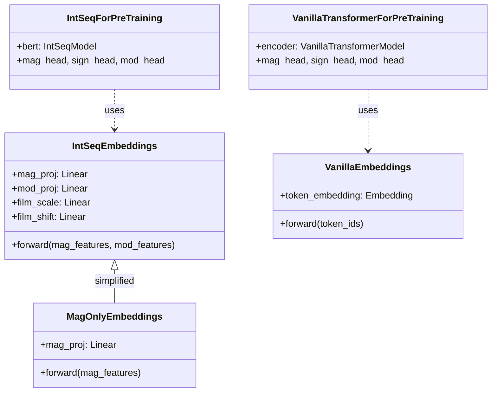

# `src/intseq_bert/intseq_models.py` 実装仕様書

## 1. 概要

本モジュールは、IntSeqBERT のニューラルネットワーク定義を担当する。
HuggingFace Transformers の設計思想を踏襲し、**埋め込み層 (`Embeddings`)**、**ベースモデル (`Model`)**、**事前学習用モデル (`ForPreTraining`)** の3層クラス構成とする。

> **関連仕様:** 共通コンポーネント（基底クラス、損失計算）は [base_models.md](./base_models.md) を参照。

特徴:
- **FiLM (Feature-wise Linear Modulation)** によるデュアルストリーム統合
- **Heteroscedastic Regression** による不確実性推定（Huber損失ベース）
- **FP32強制演算** による数値安定性確保（極端なlog値対応）
- **固定損失重み** によるマルチタスク学習の安定化（`w_mag=1.0`, `w_sign=1.0`, `w_mod=2.0`）

---

## 2. 依存関係

### ライブラリ
- `torch`, `torch.nn`, `math`

### 設定 (`config.py`)

| 定数 | 値 | 用途 |
|------|------|------|
| `MAG_EXTENDED_DIM` | 5 | 入力 Magnitude 次元（is_masked 含む） |
| `MOD_FEATURE_DIM` | 200 | 入力 Modulo Sin/Cos 次元 |
| `MOD_RANGE` | `list(range(2, 102))` | 法のリスト (2〜101) |
| `NUM_MODULI` | 100 | 法の数 |

### 追加定義（`config.py` に追加）

```python
# Sign class indices (matches MAG_EXTENDED_DIM order)
SIGN_POSITIVE = 0  # sign+ column in features
SIGN_NEGATIVE = 1  # sign- column in features
SIGN_ZERO = 2      # sign0 column in features
```

### v3 アーキテクチャ設定

| 定数 | デフォルト | 用途 |
|------|------------|------|
| `INPUT_PROJ_TYPE` | `'mlp'` | 入力射影の種類 (`'linear'` or `'mlp'`) |
| `USE_PRE_FILM_DROPOUT` | `True` | FiLM融合前のドロップアウト有無 |
| `DROPOUT` | `0.2` | デフォルトドロップアウト率 (v3で増加) |

### v3 損失設定

| 定数 | デフォルト | 用途 |
|------|------------|------|
| `MAG_LOSS_TYPE` | `'huber'` | Magnitude損失種類 (`'huber'`, `'mse'`, `'l1'`) |
| `USE_HETEROSCEDASTIC_LOSS` | `False` | 不確実性推定の有無 |

---

## 3. クラス設計

### 3.1. `IntSeqEmbeddings` (Input Layer)

数値の「大きさ」と「周期性」を融合する層。周期性が大きさを「変調（Modulate）」する FiLM 機構を採用。

#### `__init__` 引数

| 引数 | 型 | デフォルト | 説明 |
|------|------|-----------|------|
| `d_model` | int | `config.D_MODEL` | 隠れ層次元 |
| `dropout` | float | `config.DROPOUT` | ドロップアウト率 |
| `max_len` | int | `config.MAX_SEQUENCE_LENGTH` | 最大系列長 |

#### ネットワーク構成

```python
# mag_proj: config.INPUT_PROJ_TYPE で決定
if INPUT_PROJ_TYPE == 'mlp':
    mag_proj = Sequential(Linear(5, d_model), GELU(), Linear(d_model, d_model))
else:  # 'linear'
    mag_proj = Linear(MAG_EXTENDED_DIM, d_model)

mod_proj:    Linear(MOD_FEATURE_DIM, d_model)
film_scale:  Linear(d_model, d_model)  # γ生成
film_shift:  Linear(d_model, d_model)  # β生成
pos_encoding: Sinusoidal (固定、max_len x d_model)
layer_norm:  LayerNorm(d_model)
dropout:     Dropout(dropout)
```

#### 初期化

```python
# FiLM γ を 0 に初期化（学習初期に h_mag を破壊しない）
nn.init.zeros_(self.film_scale.weight)
nn.init.zeros_(self.film_scale.bias)
```

#### `forward` 入出力

**入力:**
- `mag_features`: `(B, L, 5)` - Magnitude stream (with is_masked flag)
- `mod_features`: `(B, L, 200)` - Modulo Sin/Cos stream

**出力:**
- `embeddings`: `(B, L, d_model)`

#### 処理フロー

```
1. Projection (FP32強制):
   # FP16オーバーフロー防止のため、mag_projはautocast無効で実行
   mag_features = mag_features.float()
   with torch.amp.autocast(enabled=False):
       h_mag = mag_proj(mag_features)      # (B, L, d_model), FP32
   h_mod = ReLU(mod_proj(mod_features))    # (B, L, d_model)

1.5. Pre-FiLM Dropout (v3):
   # USE_PRE_FILM_DROPOUT が True の場合のみ
   if config.USE_PRE_FILM_DROPOUT:
       h_mag = dropout(h_mag)
       h_mod = dropout(h_mod)

2. FiLM Parameter Generation:
   γ = film_scale(h_mod)                   # (B, L, d_model)
   β = film_shift(h_mod)                   # (B, L, d_model)

3. Modulation (FP32):
   γ = γ.float()
   β = β.float()
   h_fused = (1 + γ) ⊙ h_mag + β           # Element-wise

4. Post-Process:
   h_out = LayerNorm(h_fused + PosEncoding[:L].float())
   h_out = Dropout(h_out)
```

> **Note:** OEISデータには `10^210` レベルの極端な数値が含まれる（log値 = 210）。
> FP16の最大値（約65504）を超える中間計算が発生するため、Magnitude関連の演算はFP32を強制する。

---

### 3.2. `IntSeqModel` (Base Backbone)

Transformer Encoder をラップするメインモデル。

#### `__init__` 引数

| 引数 | 型 | 説明 |
|------|------|------|
| `d_model` | int | 隠れ層次元 |
| `nhead` | int | Attention ヘッド数 |
| `num_layers` | int | Encoder 層数 |
| `dropout` | float | ドロップアウト率 |

#### 構成

```python
embeddings: IntSeqEmbeddings(d_model, dropout)
encoder:    nn.TransformerEncoder(
              nn.TransformerEncoderLayer(
                d_model, nhead,
                dim_feedforward=d_model * 4,
                dropout=dropout,
                batch_first=True,
                norm_first=True  # Pre-LN for training stability
              ),
              num_layers=num_layers
            )
```

#### `forward` 入出力

**入力:**
- `mag_features`: `(B, L, 5)`
- `mod_features`: `(B, L, 200)`
- `src_key_padding_mask`: `(B, L)` - BoolTensor, `True` = Padding

**出力:**
- `last_hidden_state`: `(B, L, d_model)`

---

### 3.3. `IntSeqForPreTraining` (Heads & Loss)

事前学習（Masked Modeling）用のヘッドと損失計算を持つラッパークラス。

#### 予測ヘッド構成

| ヘッド | 構造 | 出力 | 精度 |
|--------|------|------|------|
| `mag_head` | `Linear(d_model, d_model) → ReLU → Linear(d_model, 2)` | `[μ, log(σ²)]` | **FP32強制** |
| `sign_head` | `Linear(d_model, 3)` | Logits for `[Positive, Negative, Zero]` | FP16/FP32 |
| `mod_head` | `Linear(d_model, sum(MOD_RANGE))` | 全 Modulo ロジット結合 (~5150次元) | FP16/FP32 |

> **Note:** `sign_head` のクラス順序は `config.SIGN_POSITIVE=0`, `SIGN_NEGATIVE=1`, `SIGN_ZERO=2` に対応。
>
> **Note:** `mag_head` は `torch.amp.autocast(enabled=False)` 内で実行され、入力を `.float()` でFP32に変換する。これにより極端なlog値（最大210）の処理時でも数値安定性を確保する。

#### 固定損失重み

```python
loss_weights: register_buffer(torch.tensor([1.0, 1.0, 2.0]))  # [w_mag, w_sign, w_mod]
```

タスク間のバランスを維持するための固定重み。Modulo タスクには2倍の重みを与え、周期性情報の学習を促進する。

> **Note:** 当初は Automatic Weighted Loss (Kendall et al., 2018) を採用していたが、Magnitude タスクの不確実性パラメータが過度に低下し、Modulo タスクが崩壊する問題（Task Collapse）が発生したため、固定重みに変更した。

#### `forward` 入出力

**入力:**

| 引数 | 型 | 必須 | 説明 |
|------|------|------|------|
| `mag_features` | `(B, L, 5)` | ✅ | Magnitude stream |
| `mod_features` | `(B, L, 200)` | ✅ | Modulo stream |
| `src_key_padding_mask` | `(B, L)` | ✅ | Padding mask |
| `labels` | Dict | | 学習時のみ |

**labels 辞書:**

| キー | 型 | 説明 |
|------|------|------|
| `mag_targets` | `(B, L)` Float | 元の `MAG_FEATURES[:, :, 0]` (= `1 + log10(\|x\|)`) |
| `sign_targets` | `(B, L)` Long | クラスインデックス (0=Pos, 1=Neg, 2=Zero) |
| `mod_targets` | `(B, L, 100)` Long | 各法の剰余値 |
| `mask_map` | `(B, L)` Bool | `True` = マスク位置（損失計算対象） |

**出力:**

```python
{
  "loss": Tensor (scalar),  # 学習時のみ
  "predictions": {
    "mag_mu": (B, L),
    "mag_log_var": (B, L),
    "sign_logits": (B, L, NUM_SIGN_CLASSES),
    "mod_logits": (B, L, ~5150)
  },
  "loss_breakdown": {  # 学習時のみ、モニタリング用
    "raw_mag": Tensor (scalar),   # Magnitude 損失
    "raw_sign": Tensor (scalar),  # Sign 損失
    "raw_mod": Tensor (scalar),   # Modulo 損失
    "w_mag": Tensor (scalar),     # Mag の固定重み (1.0)
    "w_sign": Tensor (scalar),    # Sign の固定重み (1.0)
    "w_mod": Tensor (scalar)      # Mod の固定重み (2.0)
  }
}
```

---

## 4. 損失計算

マスクされた位置 (`mask_map == True`) のみを対象に計算。

### 4.1. Magnitude Loss (v3: 設定可能)

損失関数と不確実性推定はconfig経由で切り替え可能。

#### 損失タイプ (`config.MAG_LOSS_TYPE`)

| 値 | 損失関数 | 特徴 |
|----|---------|------|
| `'huber'` | SmoothL1Loss | デフォルト、外れ値にロバスト |
| `'mse'` | MSELoss | 二乗誤差 |
| `'l1'` | L1Loss | 絶対値誤差 |

#### 処理フロー

```python
# FP32強制（FP16オーバーフロー防止）
target_mag = labels["mag_targets"][mask_map].float()
pred_mu = mag_mu[mask_map].float()
pred_log_var = mag_log_var[mask_map].float()

# 再構成損失の計算（config.MAG_LOSS_TYPE に応じて分岐）
if config.MAG_LOSS_TYPE == 'huber':
    recon_loss = smooth_l1_loss(pred_mu, target_mag, beta=1.0)
elif config.MAG_LOSS_TYPE == 'mse':
    recon_loss = mse_loss(pred_mu, target_mag)
elif config.MAG_LOSS_TYPE == 'l1':
    recon_loss = l1_loss(pred_mu, target_mag)

# 不確実性推定（config.USE_HETEROSCEDASTIC_LOSS で切り替え）
if config.USE_HETEROSCEDASTIC_LOSS:
    # Gaussian NLL with learned variance
    pred_log_var = clamp(pred_log_var, -10, 10)
    precision = exp(-pred_log_var)
    loss_mag_per_sample = 0.5 * pred_log_var + recon_loss * precision
    loss_mag_per_sample = clamp(loss_mag_per_sample, max=100.0)
    L_mag = mean(loss_mag_per_sample)
else:
    # Simple deterministic loss (pred_log_var ignored)
    L_mag = mean(recon_loss)
```

> **v3変更:** `USE_HETEROSCEDASTIC_LOSS = False` がデフォルト。
> 安定性確保のため、不確実性推定はオプションに変更された。

### 4.2. Sign Loss

```
L_sign = CrossEntropyLoss(sign_logits, sign_targets)
```

### 4.3. Modulo Loss

```python
# 各法の損失を、その法の最大エントロピー log(m) で正規化する
# これにより、ランダム予測時の損失が全ての法で 1.0 に揃う
L_mod_list = []
for m in MOD_RANGE:
    loss_m = CrossEntropy(logits_m, targets[:, m])
    norm_loss_m = loss_m / log(m)  # normalize by natural log
    L_mod_list.append(norm_loss_m)

L_mod = mean(L_mod_list)
```

`mod_head` 出力を `_split_mod_logits()` で各法にスライス。

### 4.4. 統合損失 (固定重み)

```
L_total = w_mag * L_mag + w_sign * L_sign + w_mod * L_mod
```

ここで重みは固定値: `w_mag = 1.0`, `w_sign = 1.0`, `w_mod = 2.0`。

---

## 5. Helper Methods

### `_split_mod_logits(logits: Tensor) -> List[Tensor]`

巨大な `mod_head` 出力を各法に対応するロジットに分割。

```python
def _split_mod_logits(self, logits: Tensor) -> List[Tensor]:
    # logits: (*, sum(MOD_RANGE))
    return torch.split(logits, config.MOD_RANGE, dim=-1)
    # Returns: List of (*, 2), (*, 3), ..., (*, 101)
```

### `_generate_sinusoidal_encoding(max_len: int, d_model: int) -> Tensor`

固定 Sinusoidal Positional Encoding を生成。

```python
def _generate_sinusoidal_encoding(max_len, d_model):
    pe = torch.zeros(max_len, d_model)
    position = torch.arange(0, max_len).unsqueeze(1)
    div_term = torch.exp(torch.arange(0, d_model, 2) * (-math.log(10000.0) / d_model))
    pe[:, 0::2] = torch.sin(position * div_term)
    pe[:, 1::2] = torch.cos(position * div_term)
    return pe  # (max_len, d_model)
```

---

## 6. 将来の拡張検討 (Phase 2)

| 項目 | 内容 | 優先度 |
|------|------|--------|
| Relative Positional Encoding | 隣接項関係の学習強化 (RoPE 等) | 中 |
| Gradient Checkpointing | メモリ効率化 | 低 |

---

## 7. Baseline / Ablation モデル

ベースライン比較およびアブレーション実験用のモデル定義。
提案手法 (IntSeqBERT) との公平な比較のため、Transformer Encoder 部分は同一アーキテクチャを共有する。

### 7.1. クラス継承構造



---

### 7.2. `VanillaEmbeddings` (Single Stream Input Layer)

数値を離散トークンとして扱う標準的な Embedding 層。FiLM や Dual Stream を使用しない。

#### `__init__` 引数

| 引数 | 型 | デフォルト | 説明 |
|------|------|-----------|------|
| `vocab_size` | int | `config.VANILLA_VOCAB_SIZE` | トークン語彙サイズ |
| `d_model` | int | `config.D_MODEL` | 隠れ層次元 |
| `dropout` | float | `config.DROPOUT` | ドロップアウト率 |
| `max_len` | int | `config.MAX_SEQUENCE_LENGTH` | 最大系列長 |

#### ネットワーク構成

```python
token_embedding: nn.Embedding(vocab_size, d_model)
pos_encoding:    Sinusoidal (固定、max_len x d_model)
layer_norm:      LayerNorm(d_model)
dropout:         Dropout(dropout)
```

#### `forward` 入出力

**入力:**
- `token_ids`: `(B, L)` - 数値トークンID

**出力:**
- `embeddings`: `(B, L, d_model)`

#### 処理フロー

```
1. Token Embedding:
   x = token_embedding(token_ids)     # (B, L, d_model)

2. Add Position Encoding:
   x = x + pos_encoding[:, :L, :]

3. Post-Process:
   x = LayerNorm(x)
   x = Dropout(x)
```

---

### 7.3. `VanillaTransformerModel` (Baseline Backbone)

標準的な Transformer Encoder。`IntSeqModel` と同じ Encoder 構造を持つが、入力層が異なる。

#### `__init__` 引数

| 引数 | 型 | 説明 |
|------|------|------|
| `vocab_size` | int | トークン語彙サイズ |
| `d_model` | int | 隠れ層次元 |
| `nhead` | int | Attention ヘッド数 |
| `num_layers` | int | Encoder 層数 |
| `dropout` | float | ドロップアウト率 |

#### 構成

```python
embeddings: VanillaEmbeddings(vocab_size, d_model, dropout)
encoder:    nn.TransformerEncoder(...)  # IntSeqModel と同一
```

#### `forward` 入出力

**入力:**
- `token_ids`: `(B, L)` - 数値トークンID
- `src_key_padding_mask`: `(B, L)` - BoolTensor, `True` = Padding

**出力:**
- `last_hidden_state`: `(B, L, d_model)`

---

### 7.4. `VanillaTransformerForPreTraining` (Baseline Heads & Loss)

ベースラインモデルの事前学習ラッパー。予測ヘッドと損失計算は `IntSeqForPreTraining` と同一。

#### 予測ヘッド構成

`IntSeqForPreTraining` と同一（`mag_head`, `sign_head`, `mod_head`）。

#### `forward` 入出力

**入力:**

| 引数 | 型 | 必須 | 説明 |
|------|------|------|------|
| `token_ids` | `(B, L)` | ✅ | 数値トークンID |
| `src_key_padding_mask` | `(B, L)` | ✅ | Padding mask |
| `labels` | Dict | | 学習時のみ（形式は `IntSeqForPreTraining` と同一） |

**出力:**
`IntSeqForPreTraining` と同一の辞書構造。

---

### 7.5. トークン化仕様

Vanilla Transformer では数値を離散トークンに変換する必要がある。

#### 語彙設計

| トークン種別 | ID範囲 | 説明 |
|-------------|--------|------|
| `[PAD]` | 0 | パディング |
| `[MASK]` | 1 | マスクトークン |
| `[UNK]` | 2 | 未知トークン（語彙外の数値） |
| 数値トークン | 3〜 | 頻出数値に対応（例: 0, 1, 2, ..., 999 等） |

#### config への追加

```python
# config.py
VANILLA_VOCAB_SIZE = 20003    # [PAD], [MASK], [UNK] + 数値 0..19,999
VANILLA_PAD_TOKEN_ID = 0
VANILLA_MASK_TOKEN_ID = 1
VANILLA_UNK_TOKEN_ID = 2
```

> **Note:** 語彙サイズは OEIS データセットの数値分布に基づいて調整する。
> 語彙外の数値は `[UNK]` にマッピングされ、これがベースラインの性能上限となる。

---

### 7.6. MagOnlyEmbeddings (Ablation: No-Mod)

Modulo Stream を除去した Ablation 用 Embedding 層。

#### `__init__` 引数

`IntSeqEmbeddings` と同一（ただし `mod_proj`, `film_*` は持たない）。

#### ネットワーク構成

```python
mag_proj:     Linear(MAG_EXTENDED_DIM, d_model)
pos_encoding: Sinusoidal (固定)
layer_norm:   LayerNorm(d_model)
dropout:      Dropout(dropout)
```

#### `forward` 入出力

**入力:**
- `mag_features`: `(B, L, 5)` - Magnitude stream のみ

**出力:**
- `embeddings`: `(B, L, d_model)`

#### 処理フロー

```
1. Projection:
   h_mag = mag_proj(mag_features)     # (B, L, d_model)

2. Add Position Encoding:
   h_out = h_mag + pos_encoding[:, :L, :]

3. Post-Process:
   h_out = LayerNorm(h_out)
   h_out = Dropout(h_out)
```

> **Note:** FiLM 変調なしの単純な投影。IntSeqBERT との差分を測定することで、Modulo Stream の寄与度を評価する。
